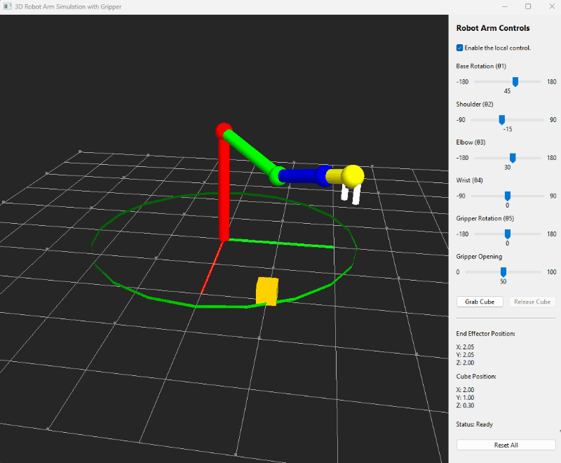

# Python_3D_6Axis_Robotic_Arm_Simulator

**Program Design Purpose** : We want to create a PLC controlled robot arm simulation system with the OPCUA-TCP communication interface. The simulator system can be used as a cyber twin for robot arm control and OT security training.  This module is a simple simulator for a robotic arm by using the wxPython and OpenGL library.



Main UI will be like this:


```python
# Author:      Yuancheng Liu
# Created:     2026/01/18
# Version:     v_0.0.1
# Copyright:   Copyright (c) 2026 Liu Yuancheng
# License:     MIT License
```

Controller UI:


The Idea is from this video:

https://youtu.be/zG4QcdsL4rM?si=WMlkdku4BwK09EiY