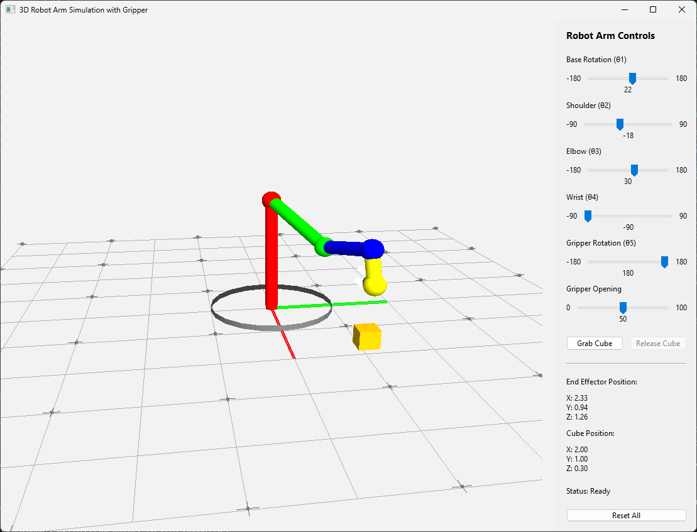
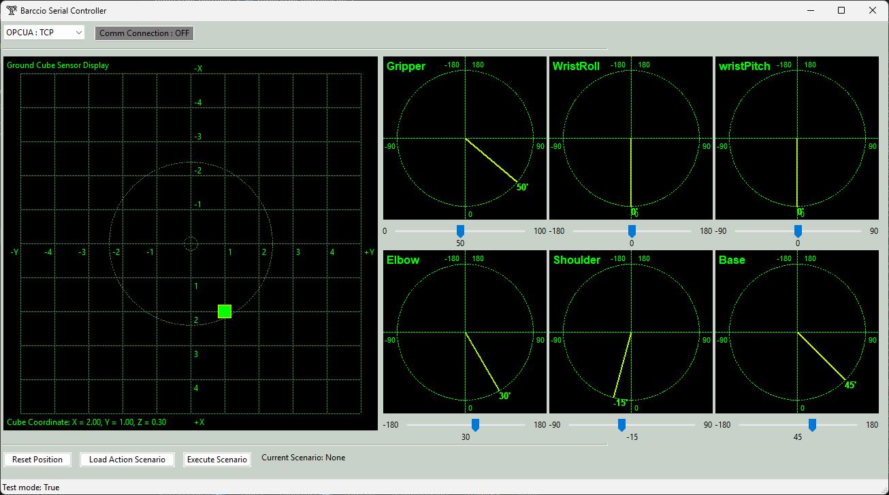

# 3D_6Axis_Robotic_Arm_Simulator with Python-wxPython-OpenGL and OPC-UA

**Project Design Purpose** : The goal of this project is to develop a software-based cyber-physical twin simulation system of the 3D 6-Axis Robotic Arm in OT environment utilizing `Python`, `wxPython`, `OpenGL`, and the `OPC-UA` protocol. The system design follows the international standard automation ISA-95 (IEC/ISO 62264) and serves as a sophisticated Cyber Twin, bridging the gap between virtual simulation and industrial automation. 

The simulation system include three main modules mirror the ISA-95 automation hierarchy: 1. Robot Arm Simulator (Level 0 - Field Level),  2. Robot Arm OPC-UA PLC (Level 1 - Control Level) and 3. User Remote Controller (Level 2 - Supervisory Level). By integrating real-time physics simulation with industrial communication standards, the project provides a safe, scalable environment for robotics control development and OT security training.

The system overview demo is shown below:


```python
# Author:      Yuancheng Liu
# Created:     2026/01/20
# Version:     v_0.0.3
# Copyright:   Copyright (c) 2026 LiuYuancheng
# License:     MIT License
```

**Table of Contents** 

[TOC]

------


Main UI will be like this:



```python
# Author:      Yuancheng Liu
# Created:     2026/01/18
# Version:     v_0.0.1
# Copyright:   Copyright (c) 2026 Liu Yuancheng
# License:     MIT License
```

Controller UI:



The Idea is from this video:


This module is a simple simulator for a robotic arm by using the wxPython and OpenGL library.


https://youtu.be/zG4QcdsL4rM?si=WMlkdku4BwK09EiY