# 3D_6Axis_Robotic_Arm_Simulator with Python-wxPython-OpenGL and OPC-UA [Cyber Twin]

**Project Design Purpose** : The goal of this project is to develop a software-based cyber-physical twin simulation system of the 3D 6-Axis Robotic Arm in OT environment utilizing `Python`, `wxPython`, `OpenGL`, and  `OPC-UA TCP` protocol. The system design follows the international standard automation [ISA-95 (IEC/ISO 62264)](https://www.siemens.com/en-us/technology/isa-95-framework-layers/) and serves as a sophisticated Cyber Twin, bridging the gap between virtual simulation and industrial automation. 

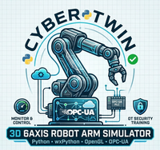

The simulation system include three main modules mirror the ISA-95 automation hierarchy: 1. Robot Arm Simulator (Level 0 - Field Level),  2. Robot Arm OPC-UA PLC (Level 1 - Control Level) and 3. User Remote Controller (Level 2 - Supervisory Level). By integrating real-time physics simulation with industrial communication standards, the project provides a safe, scalable environment for robotics control development and OT security training.

The system overview demo is shown below:

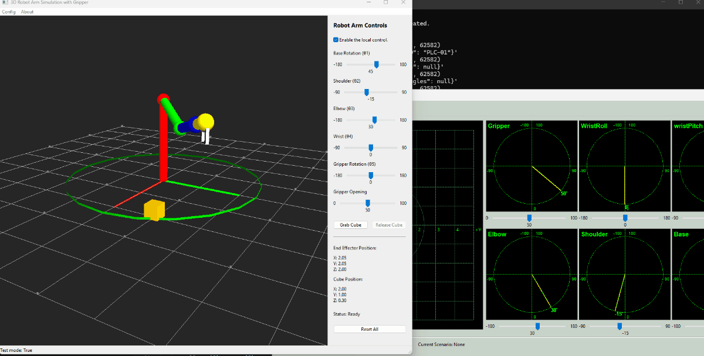

The project also provides the robot arm auto control function such as auto search and grab cube and it is used in some cyber exercise and CTF.

```python
# Author:      Yuancheng Liu
# Created:     2026/01/20
# Version:     v_0.0.3
# Copyright:   Copyright (c) 2026 LiuYuancheng
# License:     MIT License
```

**Table of Contents** 

[TOC]

------

### 1. Introduction

**Abstract** : The advancement of smart manufacturing and Industrial Control Systems (ICS) has driven the need for realistic, flexible, and secure simulation environments of robot system for both development and training purposes. In particular, robotic arms are widely used in modern production lines, where precise control, real-time monitoring, and reliable communication between system layers are critical. This project **3D 6Axis Robotic Arm Simulator with Python–wxPython–OpenGL and OPC-UA** is designed to address these needs by providing a lightweight yet functional cyber-physical simulation environment. The system enables users to visualize, monitor, and control a six-axis robotic arm while emulating real industrial communication and control workflows.

#### 1.1 Introduction of Project Background

Two years ago I have created a project to control the Braccio Plus Robot Arm: https://www.linkedin.com/pulse/braccio-plus-robot-arm-controller-yuancheng-liu-h5gfc, but this project need the hardware so it it difficult for using in cyber exercise and training which need more than one set of the system. 


The idea for this simulator project is inspired by Prof. Liu YaDong’s course "[A Robot Simulator Developed by Python, wxPython, VTK with OPC UA Support](https://youtu.be/zG4QcdsL4rM?si=WMlkdku4BwK09EiY)", as the course program source code is not publicly available and the 3D model resources TLS file for VTK needs trainee to purchase, I did some modification of the UI design with simplified approach and free lib and added some additional functions : 

- Use `OpenGL` to replace the `VTK`  to construct a simplified 3D robot arm in the canvas 
- A cube object and related cube position sensor are introduced to simulate realistic interaction scenarios
- A gripper mechanism is implemented to demonstrate object (cube) pick-and-place operations

Special thanks again to Prof. Liu YaDong for sharing the original educational content on YouTube. For reference, the original tutorial series is listed below:

- [Tutorial 0 --- A Robot Simulator Developed by Python, wxPython, VTK with OPC UA Support](https://youtu.be/zG4QcdsL4rM?si=MfSsPUuRWLiKoWmK)
- [Tutorial 1 --- Prepare Python, VTK and wxPython Environment for Robot Simulator Development](https://youtu.be/8NvP5yrUOOI?si=cIi_6sxE1dvtf8JG)
- [Tutorial 2 --- Prepare Robot OPC UA Information Model XML for Python/VTK Robot Simulator Development](https://youtu.be/-TB65k_qBB0?si=CpBeWKdAQhpFYUeZ)
- [Tutorial 3 --- Prepare Robot 3D Model for Python/VTK Robot Simulator Development](https://youtu.be/u3qc_QknfWA?si=vyf9p9UeCPD8qC8j)

#### 1.2 Introduction of System Architecture

The platform is designed based on the ISA-95 automation hierarchy pyramid, extending from Level 0 (field devices) up to Level 4 (enterprise systems). The current implementation focuses on Levels 0–2 as shown below:

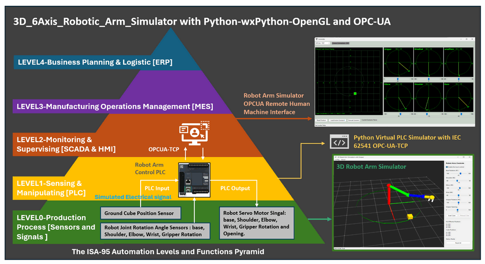

1. **Robot Arm Simulator (Level 0 - Field Level)** :  This module provides a 3D OpenGL-rendered interface to visualize the physical robot arm. It simulates hardware components—such as cube position sensors,  servo motors and tactile sensors—allowing for complex actions like object manipulation (e.g., "pick-and-place" operations). It also features a localized control panel for direct manual overrides and real-time state visualization.
2. **Robot Arm OPC-UA PLC (Level 1 - Control Level)** : Acting as the brain of the operation, this module simulates an Industrial Programmable Logic Controller (PLC). It processes incoming sensor data from the simulator and dispatches control signals back to the virtual motors, facilitating the logic loop required for autonomous or semi-autonomous motion.
3. **User Remote HMI Controller (Level 2 - Supervisory Level)** : This is the Human-Machine Interface (HMI) for the end-user. It establishes a secure connection to the PLC via the OPC-UA protocol, enabling remote monitoring of the arm’s telemetry and the execution of remote commands across a network.

#### 1.3 Introduction of System Use Cases

The modified version of this PLC controlled robot arm system is used for building the OT challenges in the below CTF competition: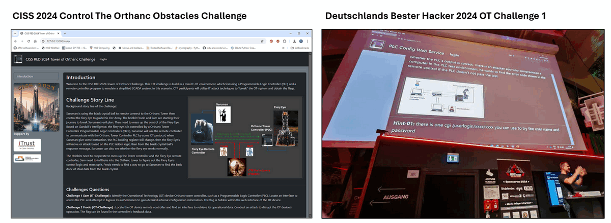

**CISS 2024 Control The Orthanc Obstacles Challenge** : 

- https://itrust.sutd.edu.sg/ciss-2024/
- https://www.linkedin.com/pulse/hacking-ics-step-by-step-guide-solve-critical-it-ot-ctf-yuancheng-liu-ohjwc

**Deutschland's Bester Hacker 2024 OT Challenge 1**   :

- https://deutschlands-bester-hacker.de/rueckblick-deutschlands-bester-hacker-2024/


------

### 2. Project Design

The system is developed using Python, with wxPython for GUI, OpenGL for 3D visualization, and OPC UA (IEC 62541) for standardized industrial communication. It is designed to emulate part of a realistic Operational Technology (OT) robot manufacture environment by integrating simulation, control logic, and supervisory monitoring into a unified platform. 

#### 2.1 System Design Objectives 

The design is guided by the following key objectives:

- **Simulate Realistic OT Behavior** : Recreate the dynamics of a servo motor-driven robotic arm, including multi-joint kinematics, sensor feedback, and actuator responses. The 3D visualization provides an intuitive representation of robot motion and interaction with objects.
- **Enable Remote Monitoring and Control** : Support real-time data exchange and control through OPC UA, allowing users to monitor system states and issue commands from a remote Human-Machine Interface (HMI).
- **Support OT Cybersecurity Training** : Provide a controlled and observable environment for analyzing industrial communication patterns, testing anomaly detection, and simulating potential attacks on PLC–HMI interactions.

#### 2.2  System Workflow Overview

The overall system workflow is shown in the diagram below, structured across three OT layers: Level 0 (simulation), Level 1 (PLC control), and Level 2 (supervisory control).

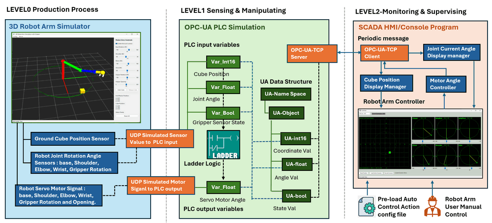

**2.2.1 Level 0 → Level 1: Sensor Data Simulation (UDP-based I/O Emulation)**

- The 3D Robot Arm Simulator (light blue color section) continuously generates simulated field data, including: Cube position (ground position sensor) and Joint rotation angles (base, shoulder, elbow, wrist, gripper). These values are transmitted to the PLC module using the UDP messages, which emulate real-world electrical or analog signal acquisition from physical sensors. 
- At the OPC-UA PLC (Level 1) side, the incoming UDP data is mapped to the `PLC local input variables`, then the variables are stored in the OPC UA address space (UA Namespace / UA Objects), for the UA data storage type : `UA-Int16` → cube coordinate values, `UA-Float` → joint angles, `UA-Bool` → gripper pressure sensor state. 

**2.2.2 Level 1: PLC Decision-Making and Ladder Logic Execution**

The PLC module acts as the core control engine. It is implemented using the [Virtual PLC Simulation framework](https://github.com/LiuYuancheng/PLC_and_RTU_Simulator) I developed before. The module supports: adder logic execution and OPC UA server functionality. The control loop operates as follows below steps:

- Step1 : Read current sensor values (e.g., joint angles)
- Step2 : Compare with target values (from HMI or predefined sequence)
- Step3 : Execute control logic to determine required motion
- Step4 : Generate output control signals (servo motor commands)

For example If the `target shoulder angle` ≠ `current angle`, the PLC continuously sends adjustment signals until the sensor feedback matches the desired position. The resulting control signals are transmitted back to the simulator via UDP, simulating actuator control signals to servo motors.

**2.2.3 Level 1 → Level 2: OPC UA Communication**

The PLC exposes all relevant data through an OPC UA server (OPC-UA-TCP), including: Joint angles, Cube position, Gripper state and Control commands. Then the Level 2 HMI/Controller connects as an OPC UA client and periodically retrieves updated values.

**2.2.4 Level 2: Supervisory Control and Visualization**

The SCADA/HMI module provides a user-facing interface for monitoring and control and the key functions include:

- Real-time Visualization: Joint angles displayed in 6-axis charts, Cube position mapped onto a 2D ground projection and System state monitoring.
- Manual Control: Users can adjust each joint angle via sliders then motor control commands are sent to the PLC through OPC UA.
- Automatic Control (Trajectory Execution) : Users can load predefined action sequences and the system executes repeated pick-and-place operations
- Motion Calculation: The controller estimates whether the robotic arm can reach the target cube and calculate the joint angles to reach the cube.


------

### 3. Implementation of Robot Arm Simulator

This section describes the detailed implementation of the Robot Arm Simulator, which represents the `Level 0 (physical/field layer)` of the system. The simulator is developed using:

- **wxPython** → for the main GUI framework host the 3D scene and interact with user's action.
- **OpenGL (GL / GLU / GLUT)** → for real-time 3D robot arm and scene rendering.

The overall UI layout and functional components are shown below:

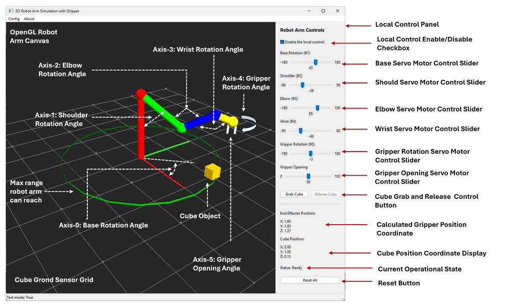

The module can run independently from other system components. A built-in local control panel allows users to directly manipulate the robot arm, making it suitable for standalone testing, debugging, and demonstration.

#### 3.1 3D Scene Module Implementation

The 3D robot arm includes 4 cylinder links with different length and multi-axis robotic joints (base, shoulder, elbow, wrist, and gripper) with the rotation range. User can adjust the length of the links in the global file.

**3.1.1 Robot Arm Cylinder Links** 

The robotic arm is modeled as a kinematic chain consisting of four rigid links connected one by one: 

| Link Index | Color  | Connection       | Rotation Base | Length    |
| ---------- | ------ | ---------------- | ------------- | --------- |
| Link-00    | Red    | Base → Shoulder  | Base          | 2.0 units |
| Link-01    | Green  | Shoulder → Elbow | Shoulder      | 1.5 units |
| Link-02    | Blue   | Elbow → Wrist    | Elbow         | 1.0 units |
| Link-03    | Yellow | Wrist → Gripper  | Wrist         | 0.5 units |

**3.1.2 Joint and Actuator Modeling**

The robot arm includes six controllable axes, each associated with: one simulated angle sensor (feedback), A servo motor (actuator), A defined rotation range and the motor can by controlled directly via the corresponding UI control slider in the control panel.

| Axis   | Function                | Surface | Sensor          | Actuator       | Range         | UI Control              |
| ------ | ----------------------- | ------- | --------------- | -------------- | ------------- | ----------------------- |
| Axis-0 | Base rotation           | X - Y   | Angle Sensor 01 | Servo Motor 01 | (-180°, 180°) | Base slider             |
| Axis-1 | Shoulder rotation       | Y - Z   | Angle Sensor 02 | Servo Motor 02 | (-90°, 90°)   | Shoulder slider         |
| Axis-2 | Elbow rotation          | Y - Z   | Angle Sensor 03 | Servo Motor 03 | (-180°, 180°) | Elbow slider            |
| Axis-3 | Wrist rotation          | Y - Z   | Angle Sensor 04 | Servo Motor 04 | (-90°, 90°)   | Wrist slider            |
| Axis-4 | Gripper rotation        | X - Y   | Angle Sensor 05 | Servo Motor 05 | (-180°, 180°) | Gripper rotation slider |
| Axis-5 | Gripper opening/closing |         | Angle Sensor 06 | Servo Motor 06 | (0°, 100°)    | Gripper opening slider  |

To simplify the simulation and avoid complex physics modeling, the gripper is constrained to always point downward along the Z-axis. This ensures stable object interaction (to the cube object) without requiring a full physics engine.

#### 3.2 Operation Function Implementation

All the robot arm joint transformations are applied sequentially, forming a complete forward kinematics chain for real-time pose updates. In this section we also add some physics simulation function to implement the collision dynamics or gravity simulation in OpenGL. 

**3.2.1 Object Interaction: Grab and Release Mechanism**

The simulator implements a simplified but effective grasping logic when the gripper position is within a `0.04-unit` threshold distance of the cube:

- The gripper closing action triggers a virtual pressure sensor checking process.

- If both gripper fingers “touch” the cube surface when the gripper motor stops closing, it will trigger the gripper finger pressure sensor.

- After pressure sensor triggered, the cube is considered successfully grasped and attached to the gripper and follows its movement. 
- Then the cube color changes to orange to indicate a successful grasp (As shown in the below diagram)

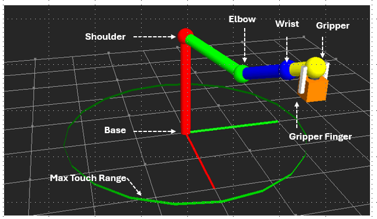

**3.2.2 Cube Gravity Simulation Algo** 

A lightweight cube gravity visually effective model is implemented within the main rendering loop:

- If the cube is not attached to the gripper : Its Z-axis position decreases gradually.
- The motion continues until the cube reaches the ground plane.

**3.2.3 Sensor Feedback and Local Monitoring Panel**

- The simulator continuously computes and displays: Gripper end-effector position (calculated via forward kinematics), Cube position (ground sensor reading) and Joint angles and gripper state.
- All values are updated in real time and shown in the local control panel, allowing users to observe system state changes during operation.
- A reset function is also provided to restore the simulation to its initial state.

**3.2.4 External Communication Interface (UDP API)**

- To integrate with higher-level modules, the simulator includes a UDP server thread that handles: Sensor data transmission (simulated wire connect to PLC inputs contact) and Motor control commands (simulated wire connect to PLC outputs coil).
- Additionally, users can develop custom programs to interact with the simulator via the provided API in Library: `lib/physicalWorldComm.py` to send control commands, retrieve sensor data, monitor system state.


------

### 4. Implementation of OPC-UA PLC

The OPC-UA PLC module represents the Level 1 (Control Layer) of the system and serves as the central decision-making unit. It is responsible for processing sensor data, executing control logic, and coordinating communication between the physical simulator (Level 0) and the supervisory controller (Level 2). The ladder logic control, UA data storage and process of the OPCUA PLC simulation module is implement with project [Python Virtual PLC Simulator with IEC 62541 OPC-UA-TCP Communication Protocol](https://www.linkedin.com/pulse/python-virtual-plc-simulator-iec-62541-opc-ua-tcp-protocol-liu-pm1pc) . For the detail you can check this link: https://github.com/LiuYuancheng/PLC_and_RTU_Simulator/tree/main/OPCUA_PLC_Simulator

#### 4.1 OPC UA Variable Mapping

| UA-Object                      | Variable Name | UA_Type    | PLC I/O Type | Related simulator Component          |
| ------------------------------ | ------------- | ---------- | ------------ | ------------------------------------ |
| RobotArmCtrl - VN_GRIPPER_CTRL | gripperCtrl   | `UA-Bool`  | PLC Input    | Gripper pressure sensor              |
| RobotArmCtrl - VN_CUBE_POS_X   | cubePosX      | `UA-Float` | PLC Input    | Cube position sensor                 |
| RobotArmCtrl - VN_CUBE_POS_Y   | cubePosY      | `UA-Float` | PLC Input    | Cube position sensor                 |
| RobotArmCtrl - VN_CUBE_POS_Z   | cubePosZ      | `UA-Float` | PLC Input    | Cube position sensor                 |
| RobotArmCtrl - VN_ARM_ANGLE_1  | armAngle1     | `UA-Float` | PLC Input    | Base rotation angle sensor           |
| RobotArmCtrl - VN_ARM_ANGLE_2  | armAngle2     | `UA-Float` | PLC Input    | Shoulder rotation angle sensor       |
| RobotArmCtrl - VN_ARM_ANGLE_3  | armAngle3     | `UA-Float` | PLC Input    | Elbow rotation angle sensor          |
| RobotArmCtrl - VN_ARM_ANGLE_4  | armAngle4     | `UA-Float` | PLC Input    | Wrist rotation angle sensor          |
| RobotArmCtrl - VN_ARM_ANGLE_5  | armAngle5     | `UA-Float` | PLC Input    | Gripper rotation angle sensor        |
| RobotArmCtrl - VN_ARM_ANGLE_6  | armAngle6     | `UA-Float` | PLC Input    | Gripper opening/closing angle sensor |
| RobotArmCtrl - VN_MOTOR1_CTRL  | motor1Ctrl    | `UA-Int16` | PLC Output   | Servo Motor 01                       |
| RobotArmCtrl - VN_MOTOR2_CTRL  | motor2Ctrl    | `UA-Int16` | PLC Output   | Servo Motor 02                       |
| RobotArmCtrl - VN_MOTOR3_CTRL  | motor3Ctrl    | `UA-Int16` | PLC Output   | Servo Motor 03                       |
| RobotArmCtrl - VN_MOTOR4_CTRL  | motor4Ctrl    | `UA-Int16` | PLC Output   | Servo Motor 04                       |
| RobotArmCtrl - VN_MOTOR5_CTRL  | motor5Ctrl    | `UA-Int16` | PLC Output   | Servo Motor 05                       |
| RobotArmCtrl - VN_MOTOR5_CTRL  | motor6Ctrl    | `UA-Int16` | PLC Output   | Servo Motor 06                       |
| HMIRequest - VN_Motor1_TGT     | motor1Target  | `UA-Int16` | N.A          | N.A (Request from Remote Controller) |
| HMIRequest - VN_Motor2_TGT     | motor2Target  | `UA-Int16` | N.A          | N.A (Request from Remote Controller) |
| HMIRequest - VN_Motor3_TGT     | motor3Target  | `UA-Int16` | N.A          | N.A (Request from Remote Controller) |
| HMIRequest - VN_Motor4_TGT     | motor4Target  | `UA-Int16` | N.A          | N.A (Request from Remote Controller) |
| HMIRequest - VN_Motor5_TGT     | motor4Target  | `UA-Int16` | N.A          | N.A (Request from Remote Controller) |
| HMIRequest - VN_Motor6_TGT     | motor6Target  | `UA-Int16` | N.A          | N.A (Request from Remote Controller) |

#### 4.2 PLC Control Cycle Workflow

The PLC operates in a **cyclic execution model**, similar to real industrial controllers. Each cycle consists of data acquisition, processing, and output update. The workflow is illustrated below:

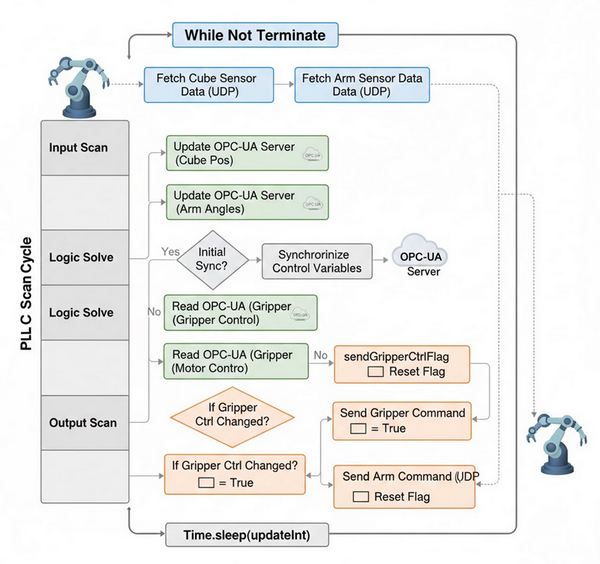

- **Input Data Acquisition (Fetch Sensors)**: The PLC simulates the collection of field data by fetching the current 3D cube coordinates and the 6-axis joint angles from the robot arm simulator.
- **OPC-UA Server Update (Variable Sync)**: The fetched sensor data is mapped to internal variables and pushed to the OPC-UA server to ensure the "Cyber Twin" reflects the physical state.
- **One-Time Initialization (Sync Parameters)**: During the first cycle (`initFlag`), the system synchronizes all internal control parameters with the OPC-UA server to ensure consistent starting states.
- **Control Logic Execution (Read & Compare)**: The PLC reads the target control values (e.g., desired motor angles or gripper states) from the OPC-UA server and compares them against its local internal state.
- **Change Detection (Set Flags)**: If a discrepancy is detected between the OPC-UA target value and the local state, the PLC triggers internal flags (`sendArmCtrlFlag` or `sendGripperCtrlFlag`) to indicate an update is required.
- **Output Update (Command Actuators)**: If flags are set, the PLC sends command signals (UDP messages) back to the 3D Robot Arm Simulator to adjust the servo motors or gripper state.


------

### 5. Implementation of HMI Remote Controller

The **HMI Remote Controller** represents the **Level 2 (Supervisory Layer)** of the system. It provides users with an interactive interface to monitor system states, issue control commands, and execute automated robot operations via **OPC UA communication** with the PLC (as introduced in the Project design section). I re-used part of the function in my [Smart Braccio ++ IoT Robot Emulator](https://www.linkedin.com/pulse/smart-iot-robot-emulator-yuancheng-liu-2v89c) Project.

The controller's interface is developed using `wxPython` and the main UI layout is shown below:

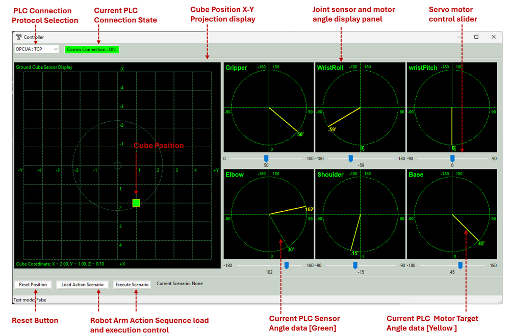

Main UI function includes:

- **PLC Connection Panel** : Allows selection of communication protocol (e.g., OPC-UA TCP, OPC-UA HTTP, UDP) and display real-time connection status. 
- **Cube Ground Projection Pos Display** : Cube X-Y Projection on ground position
- **Joint Angle Visualization Panels** : 6 Panels to show the 6 Axis joints' sensor and motor angles using circular gauges and the max rotation range, Green line for the sensor reading and yellow line for the current target motor angle. 
- **Servo Motor Control Sliders and Control Buttons**  : manual adjustment of each joint, Reset simulation state, enable auto cube grab function and Load/execute predefined action sequences. 

#### 5.1 Cube Position Mapping and Auto Grabbing

The controller uses the cube’s ground position (x, y) to estimate required joint angles to make the arm gripper reach to the area. The main algo the controller to calculate the angles will be shown below:

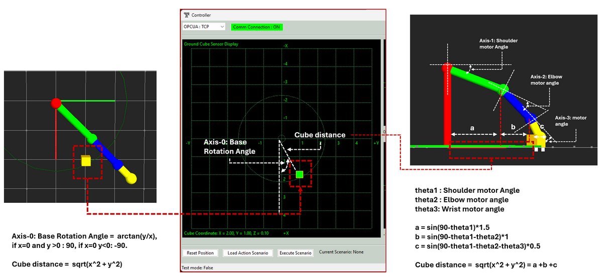

The main parameter calculation algo is shown below:

- **Base Rotation Angle (Axis-0)** : The base angle is calculated using θ₀ = arctan(y / x)  (If `x = 0` and `y > 0` → θ₀ = 90° and If `x = 0` and `y < 0` → θ₀ = -90°)
- **Distance Calculation** : Cube Distance = √(x² + y²)
- **Shoulder Rotation angle (Axis-1)** : θ₁, ground projection a = cos( θ₁ ) × 1.5
- **Elbow Rotation angle (Axis-2)** : θ₂, ground projection b = cos( θ₁ + θ₂) × 1.0
- **Wrist Rotation Angle angle (Axis-3)** : θ₃, ground projection c = cos( θ₁ + θ₂ + θ₃) × 0.5
- **X-Axis Distance Relationship**: Distance ≈ a + b + c
- **Z-Axis Projection distance 1**: d = sin( θ₁ ) x 1.5
- **Z-Axis Projection distance 2** : e = sin( θ₁+ θ₂ ) x 1.0
- **Z-Axis Projection distance 3** : f = sin( θ₁+ θ₂+ θ₃ ) x 0.5
- **Z-Axis Distance Relation ship** : 2 ≈ d+e+f

The detailed steps to calculate the angle is shown below, i use the [fsolve](https://docs.scipy.org/doc/scipy-1.15.2/reference/generated/scipy.optimize.fsolve.html) to fast to find a possible value :

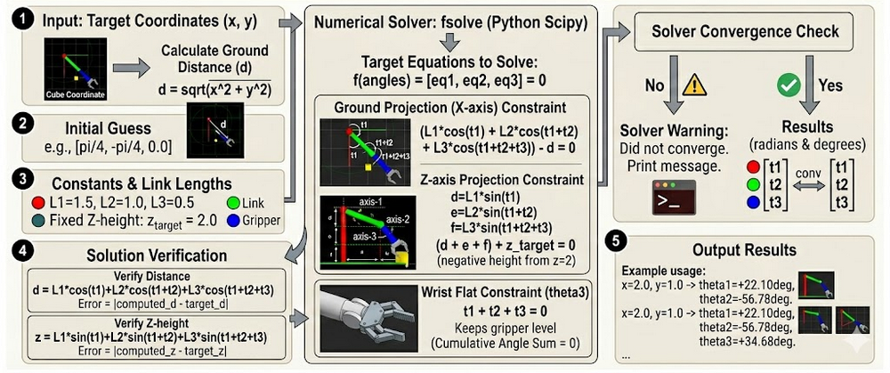

The detail operational steps to grab the cube is shown below:

- Read cube ground projection position from OPC UA PLC then calculate whether it is in the reachable area. 
- Compute required joint angles  θ₀, θ₁, θ₂, θ₃ 
- Send target angles to PLC to execute motion sequence, 
- When the arm sensor shows the arm at the correct position, send the gripper closing command to grab the cue.

A demonstration of this process is shown below (Users can trigger this function via the **“Auto Grab Cube”** button.):

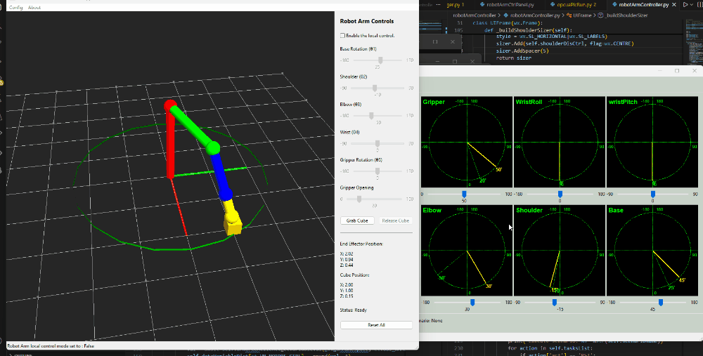

#### 5.2 Predefined Action Sequence Execution

The controller supports loading and repeat executing predefined motion sequences from a JSON configuration.

**Example Task List Json File**:

```json
[('grip', '220'), ('base', '90'), ('shld', '155'), ('elbw', '90'), ('wrtP', '205'), ('wrtR', '150'),('grip', '160'),('elbw', '130'),('base', '180'),('grip', '220'),]
```

**Execution Flow**: 

- User create the sequence Json file and put it folder "`src/robotArmController/Scenarios`".
- Presses “Execute Scenario” button then the controller will sends commands one by one to the PLC. For the execution interval, it waits for each motion to complete then proceeds to the next action. 

------

### 6. System Setup and Usage

For System Configuration and Usage, Please refer to the [System_Usage_Manual.md](System_Usage_Manual.md)

------

### 7. Summary and Reference 

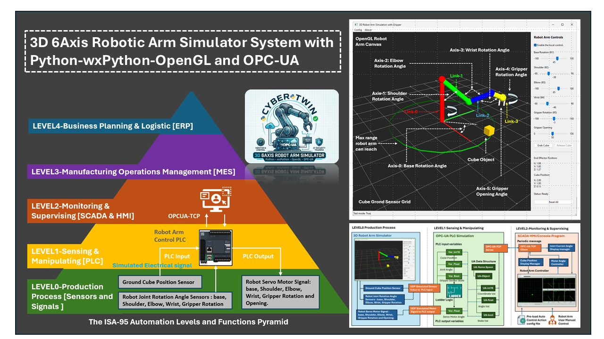

The **3D 6-Axis Robotic Arm Simulator** successfully demonstrates the integration of high-performance visualization and industrial-standard communication within a modular **Cyber-Physical System**. By aligning the architecture with the **ISA-95 hierarchy**, the project creates a realistic environment where Level 0 physics, Level 1 PLC logic, and Level 2 SCADA/HMI interaction coexist seamlessly. Utilizing **Python**, **wxPython**, and **OpenGL** allows for a lightweight yet powerful simulation of complex kinematics and sensor feedback, while the implementation of **OPC-UA** ensures the system remains relevant for modern smart manufacturing and OT cybersecurity research. Ultimately, this simulator serves as an accessible, hardware-independent platform for developers to test control algorithms and for security professionals to explore industrial protocol vulnerabilities in a safe, controlled sandbox.

- https://www.linkedin.com/pulse/braccio-plus-robot-arm-controller-yuancheng-liu-h5gfc
- https://www.linkedin.com/pulse/smart-iot-robot-emulator-yuancheng-liu-2v89c
- Python VTK lib: https://docs.vtk.org/en/latest/about.html

------

> Last edited by LiuYuancheng (liu_yuan_cheng@hotmail.com) at 20/02/2026, if you have any question please free to message me.