# 3D_6Axis_Robotic_Arm_Simulator with Python-wxPython-OpenGL and OPC-UA [Cyber Twin]

[us English](README.md) | cn 中文

**專案設計目的** : 本專案旨在開發一個基於軟體的網路實體雙生模擬系統，用於 OT 環境中的 3D 六軸機械手臂，利用 `Python`、`wxPython`、`OpenGL` 和 `OPC-UA TCP` 協定。系統設計遵循國際標準自動化 [ISA-95 (IEC/ISO 62264)](https://www.siemens.com/en-us/technology/isa-95-framework-layers/)，並作為一個精密的網路雙生系統，彌合虛擬模擬與工業自動化之間的鴻溝。

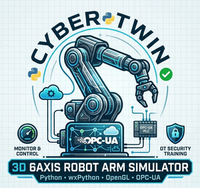

該模擬系統包含三個主要模組，反映了 ISA-95 自動化層次結構：1. 機械手臂模擬器（0 級 - 現場級）、2. 機械手臂 OPC-UA PLC（1 級 - 控制級）和 3. 用戶遠端控制器（2 級 - 監控級）。透過整合即時物理模擬與工業通訊標準，該專案為機器人控制開發和 OT 安全培訓提供了一個安全、可擴展的環境。

系統概覽演示如下所示：

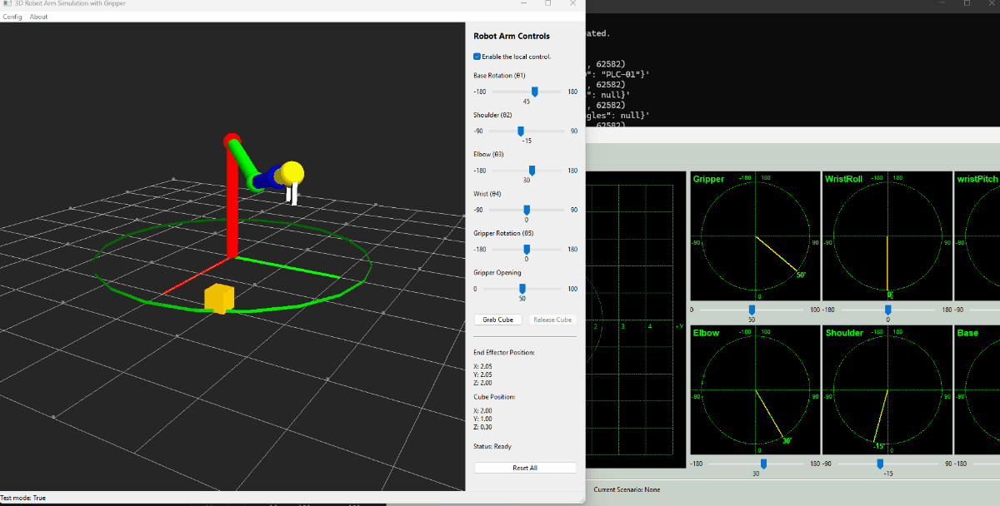

該專案還提供了機械手臂自動控制功能，例如自動搜尋和抓取方塊，並用於一些網路演習和 CTF。

```python
# Author:      Yuancheng Liu
# Created:     2026/01/20
# Version:     v_0.0.3
# Copyright:   Copyright (c) 2026 LiuYuancheng
# License:     MIT License
```

**Table of Contents** 

[TOC]

- [3D_6Axis_Robotic_Arm_Simulator with Python-wxPython-OpenGL and OPC-UA [Cyber Twin]](#3d-6axis-robotic-arm-simulator-with-python-wxpython-opengl-and-opc-ua--cyber-twin-)
    + [1. 介紹](#1---)
      - [1.1 專案背景介紹](#11-------)
      - [1.2 系統架構介紹](#12-------)
      - [1.3 系統使用案例介紹](#13---------)
    + [2. 專案設計](#2-----)
      - [2.1 系統設計目標](#21-------)
      - [2.2 系統工作流程概覽](#22---------)
    + [3. 機械手臂模擬器實作](#3----------)
      - [3.1 3D 場景模組實作](#31-3d-------)
      - [3.2 操作功能實作](#32-------)
    + [4. OPC-UA PLC 的實作](#4-opc-ua-plc----)
      - [4.1 OPC UA 變數表](#41-opc-ua----)
      - [4.2 PLC 控制時鐘週期](#42-plc-------)
    + [5. HMI Remote Controller 的實作](#5-hmi-remote-controller----)
      - [5.1 方塊位置映射和自動抓取](#51------------)
      - [5.2 預定義動作序列執行](#52----------)
    + [6. 系統設定與使用](#6--------)
    + [7. 總結與參考](#7------)
    
    

------

### 1. 介紹

**摘要** : 智慧製造和工業控制系統 (ICS) 的進步，推動了對真實、靈活且安全的機器人系統模擬環境的需求，以用於開發和培訓目的。特別是，機械手臂廣泛應用於現代生產線中，其中精確控制、即時監控以及系統層之間的可靠通訊至關重要。本專案 **3D 六軸機械手臂模擬器，支援 Python–wxPython–OpenGL 和 OPC-UA** 旨在透過提供一個輕量級但功能齊全的網路實體模擬環境來滿足這些需求。該系統使用戶能夠視覺化、監控和控制六軸機械手臂，同時模擬真實的工業通訊和控制工作流程。

#### 1.1 專案背景介紹

兩年前，我曾創建一個控制 Braccio Plus Robot Arm 的專案：https://www.linkedin.com/pulse/braccio-plus-robot-arm-controller-yuancheng-liu-h5gfc，但該專案需要硬體，因此難以用於需要多套系統的網路演習和培訓。


這個模擬器專案的靈感來自劉亞東教授的課程「[一個由 Python、wxPython、VTK 開發並支援 OPC UA 的機器人模擬器](https://youtu.be/zG4QcdsL4rM?si=WMlkdku4BwK09EiY)」，由於課程程式原始碼未公開，且 VTK 的 3D 模型資源 TLS 檔案需要學員購買，我對 UI 設計進行了一些修改，採用了簡化的方法和免費函式庫，並增加了一些額外功能：

- 使用 `OpenGL` 取代 `VTK` 在畫布中建構簡化的 3D 機械手臂
- 引入方塊物件和相關的方塊位置感測器，以模擬真實的互動場景
- 實作夾爪機構以展示物件（方塊）的夾取和放置操作

再次特別感謝劉亞東教授在 YouTube 上分享原始教育內容。供參考，原始教學系列如下：

- [教學 0 --- 一個由 Python、wxPython、VTK 開發並支援 OPC UA 的機器人模擬器](https://youtu.be/zG4QcdsL4rM?si=MfSsPUuRWLiKoWmK)
- [教學 1 --- 為機器人模擬器開發準備 Python、VTK 和 wxPython 環境](https://youtu.be/8NvP5yrUOOI?si=cIi_6sxE1dvtf8JG)
- [教學 2 --- 為 Python/VTK 機器人模擬器開發準備機器人 OPC UA 資訊模型 XML](https://youtu.be/-TB65k_qBB0?si=CpBeWKdAQhpFYUeZ)
- [教學 3 --- 為 Python/VTK 機器人模擬器開發準備機器人 3D 模型](https://youtu.be/u3qc_QknfWA?si=vyf9p9UeCPD8qC8j)

#### 1.2 系統架構介紹

該平台基於 ISA-95 自動化層次結構金字塔設計，從 0 級（現場設備）延伸至 4 級（企業系統）。目前的實作重點在於 0-2 級，如下所示：

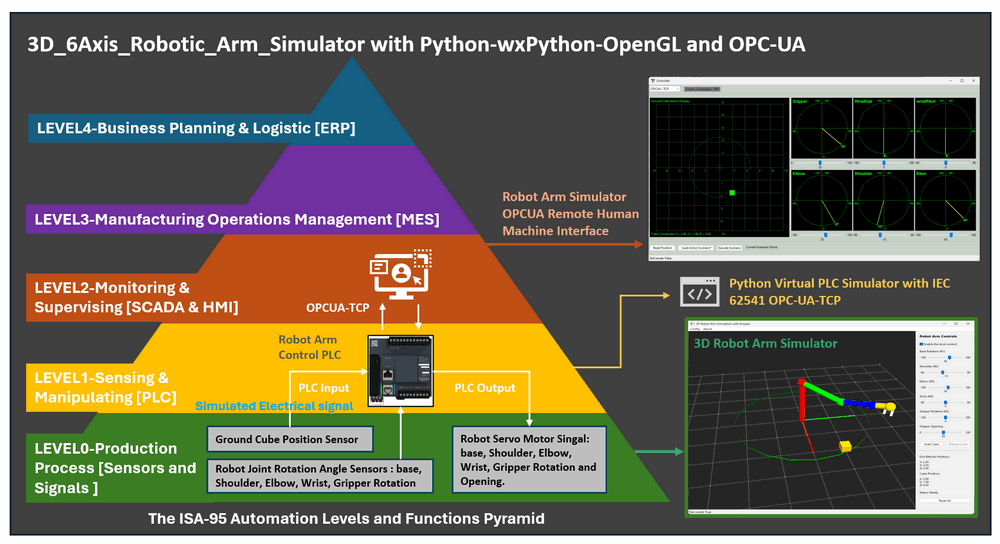

1. **機械手臂模擬器（0 級 - 現場級）** : 此模組提供一個 3D OpenGL 渲染介面，用於視覺化實體機械手臂。它模擬硬體元件，例如方塊位置感測器、伺服馬達和觸覺感測器，允許進行複雜的操作，例如物件操縱（例如「夾取和放置」操作）。它還具有一個本地化控制面板，用於直接手動覆蓋和即時狀態視覺化。
2. **機械手臂 OPC-UA PLC（1 級 - 控制級）** : 作為操作的大腦，此模組模擬一個工業可程式邏輯控制器 (PLC)。它處理來自模擬器的傳入感測器數據，並將控制訊號發送回虛擬馬達，促進自主或半自主運動所需的邏輯迴圈。
3. **用戶遠端 HMI 控制器（2 級 - 監控級）** : 這是供終端用戶使用的人機介面 (HMI)。它透過 OPC-UA 協定與 PLC 建立安全連接，實現對機械手臂遙測的遠端監控以及跨網路執行遠端命令。

#### 1.3 系統使用案例介紹

此 PLC 控制機械手臂系統的修改版本用於以下 CTF 競賽中建構 OT 挑戰：

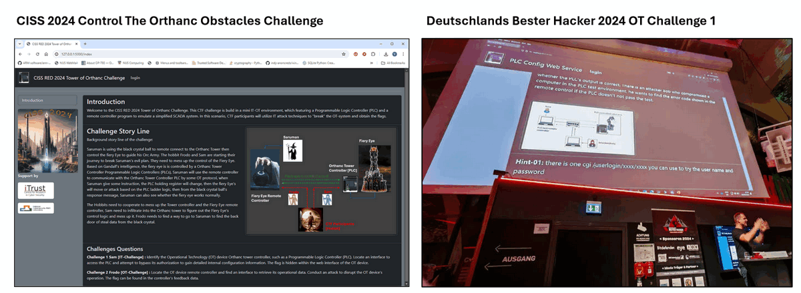

**CISS 2024 Control The Orthanc Obstacles Challenge** :

- https://itrust.sutd.edu.sg/ciss-2024/
- https://www.linkedin.com/pulse/hacking-ics-step-by-step-guide-solve-critical-it-ot-ctf-yuancheng-liu-ohjwc

**Deutschland's Bester Hacker 2024 OT Challenge 1** :

- https://deutschlands-bester-hacker.de/rueckblick-deutschlands-bester-hacker-2024/


------

### 2. 專案設計

該系統使用 Python 開發，其中 wxPython 用於 GUI，OpenGL 用於 3D 視覺化，OPC UA (IEC 62541) 用於標準化工業通訊。它的設計旨在透過將模擬、控制邏輯和監控整合到一個統一的平台中，來模擬真實的營運技術 (OT) 機器人製造環境的一部分。

#### 2.1 系統設計目標

設計遵循以下主要目標：

- **模擬真實的 OT 行為** : 重現伺服馬達驅動機械手臂的動態，包括多關節運動學、感測器回饋和致動器響應。3D 視覺化提供了機器人運動和與物件互動的直觀表示。
- **啟用遠端監控和控制** : 透過 OPC UA 支援即時數據交換和控制，允許用戶從遠端人機介面 (HMI) 監控系統狀態並發出命令。
- **支援 OT 網路安全培訓** : 提供一個受控且可觀察的環境，用於分析工業通訊模式、測試異常檢測以及模擬對 PLC–HMI 互動的潛在攻擊。

#### 2.2 系統工作流程概覽

整個系統工作流程如下圖所示，橫跨三個 OT 層：0 級（模擬）、1 級（PLC 控制）和 2 級（監控）。

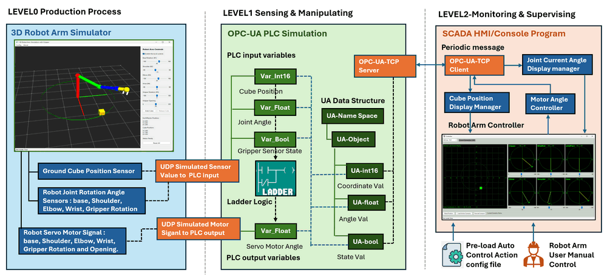

**2.2.1 0 級 → 1 級：感測器數據模擬（基於 UDP 的 I/O 模擬）**

- 3D 機械手臂模擬器（淺藍色部分）持續生成模擬的現場數據，包括：方塊位置（地面位置感測器）和關節旋轉角度（底座、肩部、肘部、腕部、夾爪）。這些值使用 UDP 訊息傳輸到 PLC 模組，模擬從實體感測器獲取真實世界的電氣或類比訊號。
- 在 OPC-UA PLC（1 級）端，傳入的 UDP 數據被映射到 `PLC local input variables`，然後變數儲存在 OPC UA 位址空間 (UA Namespace / UA Objects) 中，用於 UA 數據儲存類型：`UA-Int16` → 方塊座標值，`UA-Float` → 關節角度，`UA-Bool` → 夾爪壓力感測器狀態。

**2.2.2 1 級：PLC 決策和梯形邏輯執行**

PLC 模組作為核心控制引擎。它是使用我之前開發的 [虛擬 PLC 模擬框架](https://github.com/LiuYuancheng/PLC_and_RTU_Simulator)。該模組支援：加法器邏輯執行和 OPC UA 伺服器功能。控制迴圈按以下步驟操作：

- 步驟 1：讀取當前感測器值（例如，關節角度）
- 步驟 2：與目標值（來自 HMI 或預定義序列）進行比較
- 步驟 3：執行控制邏輯以確定所需運動
- 步驟 4：生成輸出控制訊號（伺服馬達命令）

例如，如果 `target shoulder angle` ≠ `current angle`，PLC 會持續發送調整訊號，直到感測器回饋與所需位置匹配。產生的控制訊號透過 UDP 傳輸回模擬器，模擬致動器控制訊號到伺服馬達。

**2.2.3 1 級 → 2 級：OPC UA 通訊**

PLC 透過 OPC UA 伺服器 (OPC-UA-TCP) 公開所有相關數據，包括：關節角度、方塊位置、夾爪狀態和控制命令。然後 2 級 HMI/控制器作為 OPC UA 客戶端連接，並定期檢索更新的值。

**2.2.4 2 級：監控和視覺化**

SCADA/HMI 模組提供了一個面向用戶的監控介面，其主要功能包括：

- 即時視覺化：關節角度顯示在六軸圖表中，方塊位置映射到 2D 地面投影，以及系統狀態監控。
- 手動控制：用戶可以透過滑塊調整每個關節角度，然後馬達控制命令透過 OPC UA 發送到 PLC。
- 自動控制（軌跡執行）：用戶可以載入預定義的動作序列，系統執行重複的夾取和放置操作。
- 運動計算：控制器估計機械手臂是否能到達目標方塊，並計算到達方塊所需的關節角度。


------

### 3. 機械手臂模擬器實作

本節描述了機械手臂模擬器的詳細實作，它代表了系統的 `0 級（物理/現場層）`。該模擬器是使用以下技術開發的：

- **wxPython** → 用於主 GUI 框架，承載 3D 場景並與用戶操作互動。
- **OpenGL (GL / GLU / GLUT)** → 用於即時 3D 機械手臂和場景渲染。

整體 UI 佈局和功能組件如下所示：

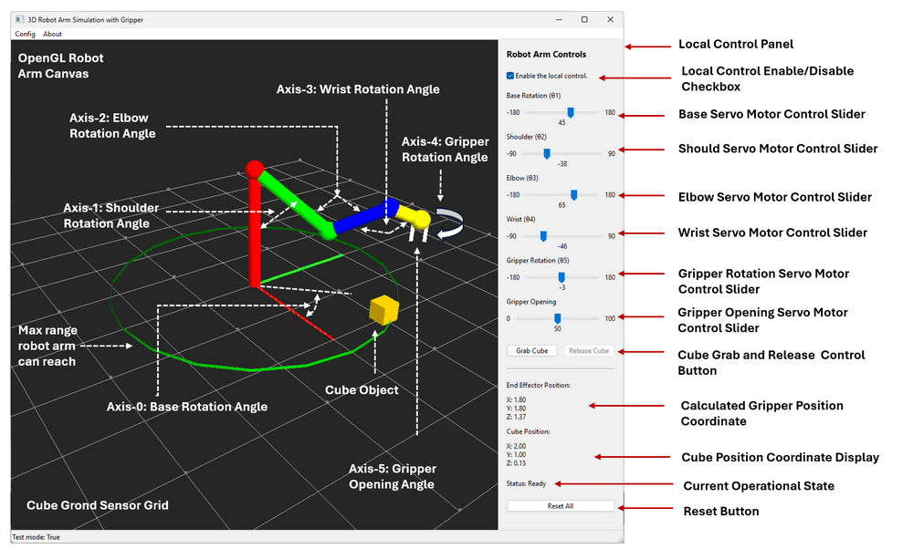

該模組可以獨立於其他系統組件運行。內建的本地控制面板允許用戶直接操作機械手臂，使其適用於獨立測試、調試和演示。

#### 3.1 3D 場景模組實作

3D 機械手臂包含 4 個不同長度的圓柱連桿和多軸機器人關節（底座、肩部、肘部、腕部和夾爪），具有旋轉範圍。用戶可以在全域檔案中調整連桿的長度。

**3.1.1 機械手臂圓柱連桿**

機械手臂被建模為一個由四個剛性連桿依次連接的運動鏈：

| 連桿索引 | 顏色 | 連接        | 旋轉基座 | 長度     |
| :------- | :--- | :---------- | :------- | :------- |
| Link-00  | 紅色 | 底座 → 肩部 | Base     | 2.0 單位 |
| Link-01  | 綠色 | 肩部 → 肘部 | Shoulder | 1.5 單位 |
| Link-02  | 藍色 | 肘部 → 腕部 | Elbow    | 1.0 單位 |
| Link-03  | 黃色 | 腕部 → 夾爪 | Wrist    | 0.5 單位 |

**3.1.2 關節和致動器建模**

機械手臂包含六個可控制軸，每個軸都與以下項目相關聯：一個模擬角度感測器（回饋）、一個伺服馬達（致動器）、一個定義的旋轉範圍，馬達可透過控制面板中相應的 UI 控制滑塊直接控制。

| 軸     | 功能     | 平面  | 感測器        | 致動器      | 範圍          | UI 控制      |
| :----- | :------- | :---- | :------------ | :---------- | :------------ | :----------- |
| Axis-0 | 底座旋轉 | X - Y | 角度感測器 01 | 伺服馬達 01 | (-180°, 180°) | 底座滑塊     |
| Axis-1 | 肩部旋轉 | Y - Z | 角度感測器 02 | 伺服馬達 02 | (-90°, 90°)   | 肩部滑塊     |
| Axis-2 | 肘部旋轉 | Y - Z | 角度感測器 03 | 伺服馬達 03 | (-180°, 180°) | 肘部滑塊     |
| Axis-3 | 腕部旋轉 | Y - Z | 角度感測器 04 | 伺服馬達 04 | (-90°, 90°)   | 腕部滑塊     |
| Axis-4 | 夾爪旋轉 | X - Y | 角度感測器 05 | 伺服馬達 05 | (-180°, 180°) | 夾爪旋轉滑塊 |
| Axis-5 | 夾爪開合 |       | 角度感測器 06 | 伺服馬達 06 | (0°, 100°)    | 夾爪開合滑塊 |

為了簡化模擬並避免複雜的物理建模，夾爪被限制為始終沿 Z 軸向下指向。這確保了穩定的物件互動（與方塊物件），而無需完整的物理引擎。

#### 3.2 操作功能實作

所有機械手臂關節變換都按順序應用，形成一個完整的正向運動學鏈，用於即時姿態更新。在本節中，我們還添加了一些物理模擬功能，以在 OpenGL 中實作碰撞動力學或重力模擬。

**3.2.1 物件互動：抓取和釋放機制**

當夾爪位置在方塊的 `0.04 單位` 閾值距離內時，模擬器實作了一個簡化但有效的抓取邏輯：

- 夾爪閉合動作會觸發虛擬壓力感測器檢查過程。
- 如果夾爪馬達停止閉合時，兩個夾爪手指都「觸摸」到方塊表面，它將觸發夾爪手指壓力感測器。
- 壓力感測器觸發後，方塊被視為成功抓取並附著到夾爪上，並隨其移動。
- 然後方塊顏色變為橙色，表示成功抓取（如下圖所示）

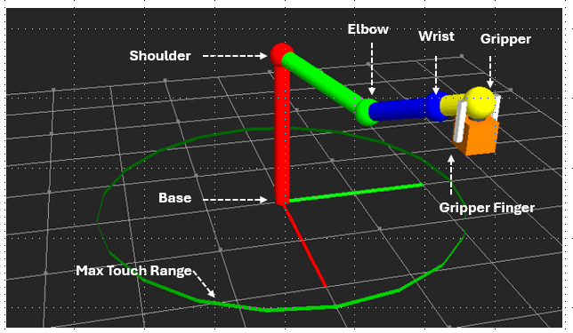

**3.2.2 方塊重力模擬演算法**

一個輕量級、視覺效果良好的方塊重力模型在主渲染迴圈中實作：

- 如果方塊未附著到夾爪上：其 Z 軸位置會逐漸下降。
- 運動持續到方塊到達地面平面。

**3.2.3 感測器回饋和本地監控面板**

- 模擬器持續計算並顯示：夾爪末端執行器位置（透過正向運動學計算）、方塊位置（地面感測器讀數）以及關節角度和夾爪狀態。
- 所有值都即時更新並顯示在本地控制面板中，允許用戶在操作期間觀察系統狀態變化。
- 還提供了重置功能，以將模擬恢復到其初始狀態。

**3.2.4 外部通訊介面 (UDP API)**

- 為了與更高級別的模組整合，模擬器包含一個 UDP 伺服器執行緒，負責處理：感測器資料傳輸（模擬電線連接到 PLC 輸入接點）和馬達控制指令（模擬電線連接到 PLC 輸出線圈）。
- 此外，使用者可以透過函式庫中提供的 API 開發自訂程式與模擬器互動：`lib/physicalWorldComm.py` 以發送控制指令、擷取感測器資料、監控系統狀態。


------

### 4. OPC-UA PLC 的實作

OPC-UA PLC 模組代表系統的第 1 層（控制層），並作為中央決策單元。它負責處理感測器資料、執行控制邏輯，並協調實體模擬器（第 0 層）與監控控制器（第 2 層）之間的通訊。OPC-UA PLC 模擬模組的梯形邏輯控制、UA 資料儲存和處理是透過專案[Python Virtual PLC Simulator with IEC 62541 OPC-UA-TCP Communication Protocol](https://www.linkedin.com/pulse/python-virtual-plc-simulator-iec-62541-opc-ua-tcp-protocol-liu-pm1pc) 實作的。詳細資訊請查閱此連結：https://github.com/LiuYuancheng/PLC_and_RTU_Simulator/tree/main/OPCUA_PLC_Simulator

#### 4.1 OPC UA 變數表

| UA 物件                        | 變數名稱     | UA_Type    | PLC I/O 類型 | 相關模擬器元件             |
| :----------------------------- | :----------- | :--------- | :----------- | :------------------------- |
| RobotArmCtrl - VN_GRIPPER_CTRL | gripperCtrl  | `UA-Bool`  | PLC Input    | 夾爪壓力感測器             |
| RobotArmCtrl - VN_CUBE_POS_X   | cubePosX     | `UA-Float` | PLC Input    | 方塊位置感測器             |
| RobotArmCtrl - VN_CUBE_POS_Y   | cubePosY     | `UA-Float` | PLC Input    | 方塊位置感測器             |
| RobotArmCtrl - VN_CUBE_POS_Z   | cubePosZ     | `UA-Float` | PLC Input    | 方塊位置感測器             |
| RobotArmCtrl - VN_ARM_ANGLE_1  | armAngle1    | `UA-Float` | PLC Input    | 底座旋轉角度感測器         |
| RobotArmCtrl - VN_ARM_ANGLE_2  | armAngle2    | `UA-Float` | PLC Input    | 肩部旋轉角度感測器         |
| RobotArmCtrl - VN_ARM_ANGLE_3  | armAngle3    | `UA-Float` | PLC Input    | 肘部旋轉角度感測器         |
| RobotArmCtrl - VN_ARM_ANGLE_4  | armAngle4    | `UA-Float` | PLC Input    | 腕部旋轉角度感測器         |
| RobotArmCtrl - VN_ARM_ANGLE_5  | armAngle5    | `UA-Float` | PLC Input    | 夾爪旋轉角度感測器         |
| RobotArmCtrl - VN_ARM_ANGLE_6  | armAngle6    | `UA-Float` | PLC Input    | 夾爪開合角度感測器         |
| RobotArmCtrl - VN_MOTOR1_CTRL  | motor1Ctrl   | `UA-Int16` | PLC Output   | 伺服馬達 01                |
| RobotArmCtrl - VN_MOTOR2_CTRL  | motor2Ctrl   | `UA-Int16` | PLC Output   | 伺服馬達 02                |
| RobotArmCtrl - VN_MOTOR3_CTRL  | motor3Ctrl   | `UA-Int16` | PLC Output   | 伺服馬達 03                |
| RobotArmCtrl - VN_MOTOR4_CTRL  | motor4Ctrl   | `UA-Int16` | PLC Output   | 伺服馬達 04                |
| RobotArmCtrl - VN_MOTOR5_CTRL  | motor5Ctrl   | `UA-Int16` | PLC Output   | 伺服馬達 05                |
| RobotArmCtrl - VN_MOTOR5_CTRL  | motor6Ctrl   | `UA-Int16` | PLC Output   | 伺服馬達 06                |
| HMIRequest - VN_Motor1_TGT     | motor1Target | `UA-Int16` | N.A          | N.A (來自遠端控制器的請求) |
| HMIRequest - VN_Motor2_TGT     | motor2Target | `UA-Int16` | N.A          | N.A (來自遠端控制器的請求) |
| HMIRequest - VN_Motor3_TGT     | motor3Target | `UA-Int16` | N.A          | N.A (來自遠端控制器的請求) |
| HMIRequest - VN_Motor4_TGT     | motor4Target | `UA-Int16` | N.A          | N.A (來自遠端控制器的請求) |
| HMIRequest - VN_Motor5_TGT     | motor4Target | `UA-Int16` | N.A          | N.A (來自遠端控制器的請求) |
| HMIRequest - VN_Motor6_TGT     | motor6Target | `UA-Int16` | N.A          | N.A (來自遠端控制器的請求) |

#### 4.2 PLC 控制時鐘週期

PLC 以週期性循環執行迴圈運作，類似於真實的工業控制器。每個時鐘週期包含資料擷取、處理和輸出更新。工作流程如下方流程圖所示：

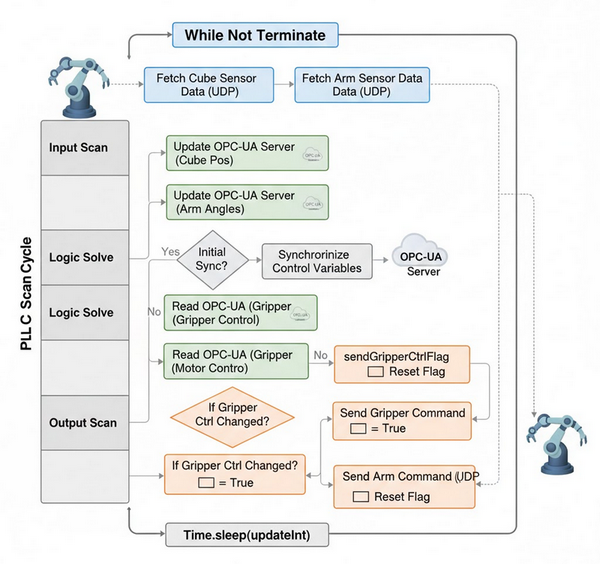

- **輸入資料擷取 (擷取感測器)**: PLC 透過從機械手臂模擬器擷取當前 3D 方塊座標和 6 軸關節角度感測器資料來模擬現場資料的收集。
- **OPC-UA 伺服器更新 (變數同步)**: 擷取的感測器資料被映射到內部變數並推送到 OPC-UA 伺服器，以確保「數位雙生」反映實體狀態。
- **一次性初始化 (同步參數)**: 在第一個週期（`initFlag`）期間，系統將所有內部控制參數與 OPC-UA 伺服器同步，以確保一致的起始狀態。
- **控制邏輯執行 (讀取與比較)**: PLC 從 OPC-UA 伺服器讀取目標控制值（例如，所需的馬達角度或夾爪狀態），並將其與其本地內部狀態進行比較。
- **變更偵測 (設定旗標)**: 如果 OPC-UA 目標值與本地狀態之間檢測到差異，PLC 會觸發內部旗標（`sendArmCtrlFlag` 或 `sendGripperCtrlFlag`）以指示需要更新。
- **輸出更新 (命令致動器)**: 如果旗標已設定，PLC 會將命令訊號（UDP 訊息）發送回 3D 機械手臂模擬器，以調整伺服馬達或夾爪狀態。

------

### 5. HMI Remote Controller 的實作

HMI Remote Controller 代表系統的第 2 層（監控層）。它為使用者提供一個互動式介面，透過與 PLC 的 OPC-UA-TCP 通訊（如專案設計部分所述）來監控系統狀態、發布控制指令並執行自動化機器人操作。我重新使用了我的[Smart Braccio ++ IoT Robot Emulator](https://www.linkedin.com/pulse/smart-iot-robot-emulator-yuancheng-liu-2v89c) 專案中的部分功能和 UI 面板。

控制器的介面是使用`wxPython` 開發的，主要 UI 佈局如下所示：

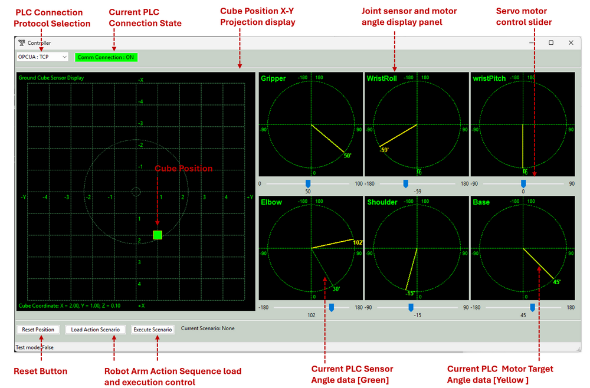

主要 UI 功能包括：

- **PLC 連線面板** : 允許選擇通訊協定（例如，OPC-UA TCP、OPC-UA HTTP、UDP）並顯示即時連線狀態。
- **方塊地面投影位置顯示** : 方塊在地面上的 X-Y 投影位置以及機械手臂可觸及的最大範圍。
- **關節角度視覺化面板** : 6 個面板用於使用圓形儀表顯示 6 軸關節的感測器和馬達角度以及最大旋轉範圍，「綠針」表示感測器讀數，「黃針」表示當前目標馬達角度。
- **伺服馬達控制滑桿和控制按鈕** : 手動調整每個關節控制馬達、重置模擬狀態、啟用自動抓取方塊功能以及載入/執行預定義的動作序列。

#### 5.1 方塊位置映射和自動抓取

為了自動搜尋和抓取場景中的物體，控制器使用方塊的地面位置`(x, y)` 來估計所需的關節角度，使機械手臂夾爪到達該位置（閾值範圍內，當前閾值距離 = 0.04 單位）。計算四個 theta 角度的主要演算法如下所示：

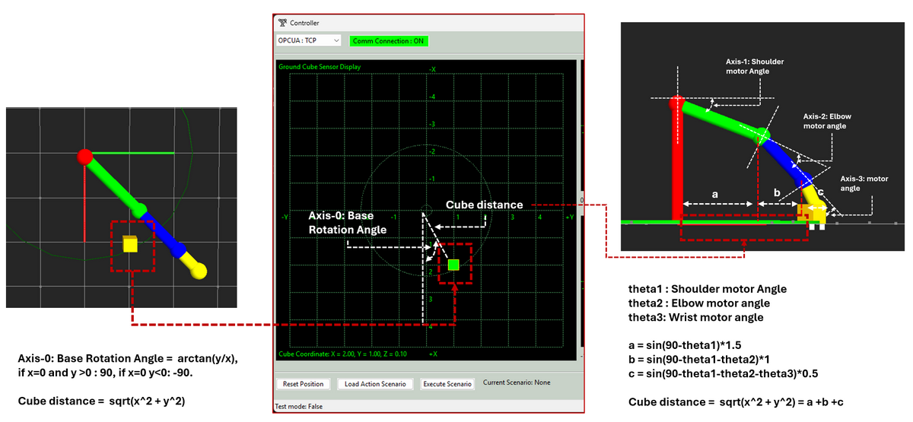

主要參數計算演算法如下所示：

- **底座旋轉角度 (Axis-0)** : 底座角度使用 θ₀ = arctan(y / x) 計算（如果`x = 0` 且如果`y > 0` → θ₀ = 90° 且如果`x = 0` 且如果`y < 0` → θ₀ = -90°）
- **距離計算** : 方塊到機械手臂底座的距離`k = √(x² + y²)`
- **肩部旋轉角度 (Axis-1)** : θ₁，地面投影距離`a = cos( θ₁ ) × 1.5`
- **肘部旋轉角度 (Axis-2)** : θ₂，地面投影距離`b = cos( θ₁ + θ₂) × 1.0`
- **腕部旋轉角度 (Axis-3)** : θ₃，地面投影距離`c = cos( θ₁ + θ₂ + θ₃) × 0.5`
- **X 軸距離關係**: 距離`k'≈ a + b + c`
- **Z 軸投影距離 1**: `d = sin( θ₁ ) x 1.5`
- **Z 軸投影距離 2** : `e = sin( θ₁+ θ₂ ) x 1.0`
- **Z 軸投影距離 3** : `f = sin( θ₁+ θ₂+ θ₃ ) x 0.5`
- **Z 軸距離關係** : 機械手臂底座距離`2 ≈ d + e + f`

計算角度的詳細步驟如下所示，我使用了 scipy [fsolve](https://docs.scipy.org/doc/scipy-1.15.2/reference/generated/scipy.optimize.fsolve.html) 來快速找到一個可能的值：

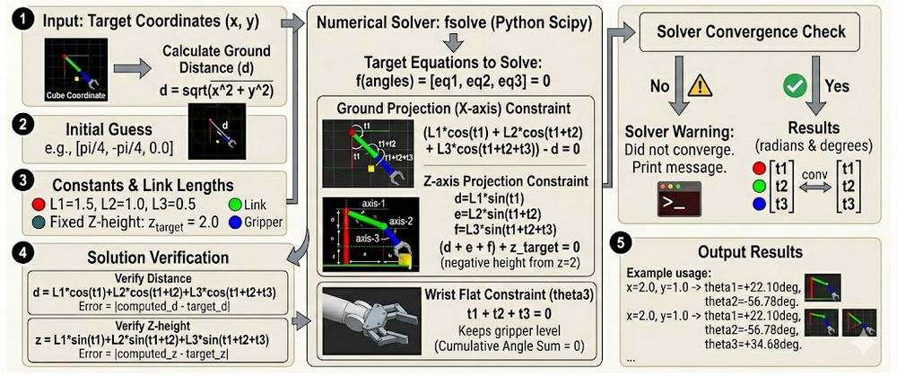

抓取方塊物體的詳細操作步驟如下所示：

- 從 OPC-UA PLC 讀取方塊地面投影位置，然後計算其是否在可觸及區域內。
- 如果方塊物體可觸及，則計算所需的關節角度 θ₀, θ₁, θ₂, θ₃ 。
- 將馬達角度目標變更指令發送給 PLC 以執行運動序列。
- 當機械手臂感測器顯示機械手臂處於正確位置時，發送夾爪閉合指令以抓取方塊。

此過程的演示如下所示（使用者可以透過「Auto Grab Cube」按鈕觸發此功能）：

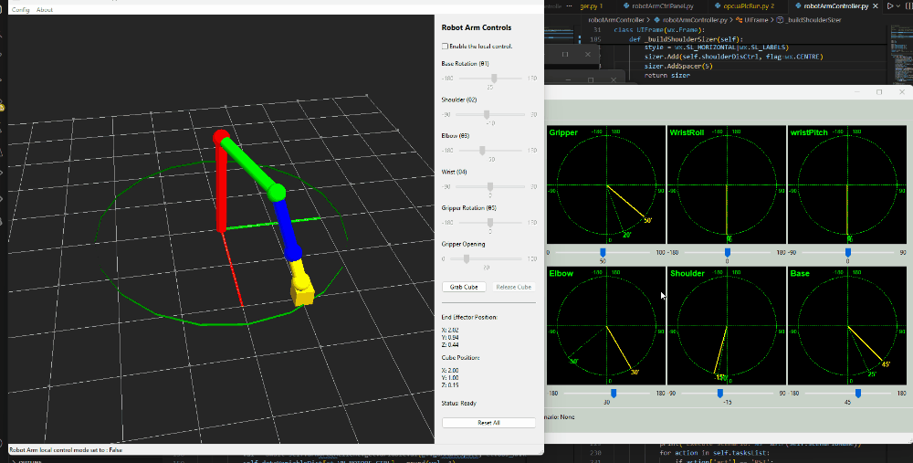

#### 5.2 預定義動作序列執行

控制器支援從 JSON 配置載入並重複執行預定義的運動序列。

**範例任務列表 JSON 檔案**:

```
[('grip', '220'), ('base', '90'), ('shld', '155'), ('elbw', '90'), ('wrtP', '205'), ('wrtR', '150'),('grip', '160'),('elbw', '130'),('base', '180'),('grip', '220'),]
```

**執行流程**:

- 使用者建立序列 JSON 檔案並將其放入資料夾「`src/robotArmController/Scenarios`」中。
- 按下「Execute Scenario」按鈕後，控制器將逐一向 PLC 發送指令。對於指令執行間隔，它會等待每個動作完成後再進行下一個動作。

### 6. 系統設定與使用

有關系統配置和使用，請參閱使用者手冊文件：

https://github.com/LiuYuancheng/Python_3D_6Axis_Robotic_Arm_Simulator/blob/main/System_Usage_Manual.md

 

### 7. 總結與參考

專案總結影片：https://youtu.be/Id3tBvNlzc4?si=pdiII1w45f2kjvS1

此**3D 6-Axis Robotic Arm Simulator** 成功展示了高性能視覺化與工業標準通訊在模組化**Cyber-Physical System** 中的整合。透過將架構與**ISA-95 hierarchy** 對齊，該專案創建了一個真實的環境，其中第 0 層物理、第 1 層 PLC 邏輯和第 2 層 SCADA/HMI 互動無縫共存。利用**Python**、**wxPython** 和**OpenGL** 實現了複雜運動學和感測器回饋的輕量級而強大的模擬，同時**OPC-UA** 的實作確保了該系統對於現代智慧製造和 OT 網路安全研究仍然具有相關性。最終，該模擬器作為一個可存取、獨立於硬體的平台，供開發人員測試控制演算法，並供安全專業人員在安全、受控的沙箱中探索工業協定漏洞。

**主要相關專案與參考**:

- https://www.linkedin.com/pulse/braccio-plus-robot-arm-controller-yuancheng-liu-h5gfc
- https://www.linkedin.com/pulse/smart-iot-robot-emulator-yuancheng-liu-2v89c
- Python VTK lib: https://docs.vtk.org/en/latest/about.html


------

> Last edited by LiuYuancheng (liu_yuan_cheng@hotmail.com) at 20/03/2026, if you have any question please free to message me.