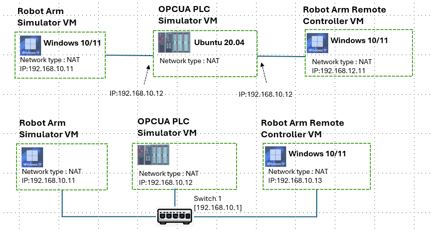
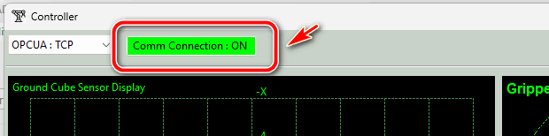

# 3D_6Axis_Robotic_Arm_Simulator System Usage Manual 

This document is the user manual to introduce the detailed steps to setup the system in you servers. The system can be configured in one computer or 3 different nodes (VMs/Dockers) with 1 ~ 2 subnets. 


```python
# Author:      Yuancheng Liu
# Created:     2026/01/24
# Version:     v_0.0.1
# Copyright:   Copyright (c) 2026 LiuYuancheng
# License:     MIT License
```

[TOC]

------

### 1. System Setup

#### 1.1 Network Configuration Topology

The three program in the system can be executed in one computer/VM, but for using in attack training or integrate with other system, we prefer you config it is 3 different VM with below network topology (2 isolated subnet):



For attack and defense cyber exercise or CTF, we prefer the first topology. 

#### 1.2 System Configuration

**Development/Execution Environment** : python 3.8.4+

**Additional Lib/Software Need** 

| Lib Module   | Version | Installation           | Lib link                           |
| ------------ | ------- | ---------------------- | ---------------------------------- |
| **asyncua**  | 1.1.5   | `pip install asyncua`  | https://pypi.org/project/asyncua/  |
| **numpy**    | 1.24.4  | `pip install numpy`    | https://numpy.org/                 |
| **PyOpenGL** | 3.1.10  | `pip install PyOpenGL` | https://pypi.org/project/PyOpenGL/ |
| **scipy**    | 1.17.1  | `pip install scipy`    | https://scipy.org/                 |
| **wxPython** | 4.1.0   | `pip install wxPython` | https://pypi.org/project/wxPython/ |

**Program Source File List** 

Library Modules 

| Program File               | Execution Env | Description                                                  |
| -------------------------- | ------------- | ------------------------------------------------------------ |
| `lib/ConfigLoader.py`      | python 3.7 +  | Provide API to load the not stand text format config file's data. |
| `lib/Log.py`               | python 3.7 +  | Provide the additional log function to do the program execution log archiving feature. |
| `lib/UdpCom.py`            | python 3.7 +  | Provide UDP communication API in the distribution system.    |
| `lib/physicalWorldComm.py` | python 3.7 +  | Provide the API for PLC to connect to the physical world or simulation module. |
| `lib/opcuaComm.py`         | python 3.7 +  | Provide the IEC62541 OPC-UA TCP client and server communication API. |


------

### 2. System Deployment And Usage

#### 2.1 Execute the robot arm simulator module

Change the configuration template `src/robotArmSimulator/robotArmSimulatorConfig_template.txt` name to `src/robotArmSimulator/robotArmSimulatorConfig.txt` then modify the configuration file as shown below:

```json
# This is the config file template for the module <robotArmSimulator.py>
# Setup the parameters with below format (every line follow <key>:<val> format, the
# key can not be changed):
#-----------------------------------------------------------------------------
UI_TITLE:3D Robot Arm Simulation with Gripper
#-----------------------------------------------------------------------------
# Test mode:
# True: Enable the local control test mode. 
# False: connect to PLC let plc control the robot arm. 
# TEST_MD:True
TEST_MD:True
#-----------------------------------------------------------------------------
# Init the dataManager port for PLC to fetch and set data. 
UDP_PORT:3001
```

Then double click the auto execution file `src/runRA_Simulator.bat` or run command:

```bash
python3 robotArmSimulator.py
```

Then you will see the 3D UI show up.


#### 2.2 Execute the robot arm control PLC module

Change the configuration template `src/robotArmCtrlPLC/plcConfig_template.txt` name to `src/robotArmCtrlPLC/plcConfig.txt` then modify the configuration file as shown below:

```json
# This is the config file template for the module <opcuaPlcRun.py>
# Setup the parameter with below format (every line follow <key>:<value> format, the
# key can not be changed):
#-----------------------------------------------------------------------------
# Set the master PLC's name 
PLC_NAME:PLC-01
#-----------------------------------------------------------------------------
# Define physical world simulator IP
RW_IP:127.0.0.1
# Define physical world simulator connection port
RW_PORT:3001
# Define PLC clock interval
CLK_INT:1
# Physical world reconnection time 
RW_RECONN_TIME:10
#-----------------------------------------------------------------------------
# Define OPCUA host IP, use 0.0.0.0 or localhost
OPCUA_IP:0.0.0.0
# Define OPCUA host Port, normally use 4840
OPCUA_PORT:4840
```

Make sure the `RW_IP` is set to the VM's IP of the robot arm simulator's VM and the port number `RW_PORT` are same. 

Then double click the auto execution file `src/runRA_PLC.bat` or run command:

```bash
python3 opcuaPlcRun.py
```

When the PLC will connect to the robot arm simulator, below logs will shows:

```
OPC-UA service thread inited with serverName=PLC-01, port=4840, nameSpace=Controller
OPC-UA Server PLC-01 initialized, name space Controller, index 2
OPC-UA service thread run.
Endpoints other than open requested but private key and certificate are not set.
PLC simulator thread started.
```


#### 2.3 Execute the Remote HMI Controller

Change the configuration template `src/robotArmController/controllerConfig_template.txt` name to `src/robotArmController/controllerConfig.txt` then modify the configuration file as shown below:

```json
# This is the config file template for the module <robotArmController.py>
# Setup the parameter with below format (every line follows <key>:<val> format, the
# key can not be changed):
#-----------------------------------------------------------------------------
# Test mode:
# True: Test the UI without connect to the robot arm controller.
# False: connect to PLC via OPC-UA client, fetch and set the PLC real state.
TEST_MD:False
#TEST_MD:True
#-----------------------------------------------------------------------------
# RobotArm OPCUA-TCP controller(PLC) information
OPCUA_PLC_ID:PLC-01
OPCUA_PLC_IP:127.0.0.1
OPCUA_PLC_PORT:4840
```

Make sure the `OPCUA_PLC_IP` is set to the VM's IP of the OPCUA PLC  simulator's VM and the port number `OPCUA_PLC_PORT` are same as the number set in the PLC machine. 

Then double click the auto execution file `src/runRA_Simulator.bat` or run command:

```
python3 robotArmController
```

When the UI show up and the connection indicator change to green means the controller is linked to the PLC module as shown below: 




------

> Last edited by LiuYuancheng (liu_yuan_cheng@hotmail.com) at 26/02/2026, if you have any question please free to message me.